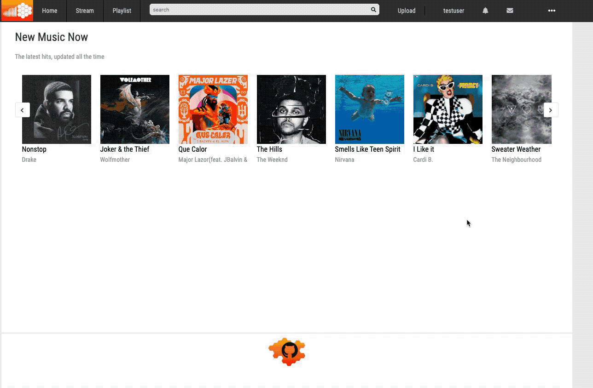

# AudioHive

## [AudioHive]("https://audiohive-aa.herokuapp.com") is a [soundcloud]("https://soundcloud.com") clone

AudioHive is a music streaming website that allows the user to upload, share, and play songs. The music player persists on all pages allowing users to explore other songs without interruptions.

## Technologies 

* React, Redux, Ruby, Rails, Jquery, PostgreSQL, AWS S3 and WaveSurfer.js

## Features

### Login / Sign up
Users are able to login or sign up using modals, to authenticate the existence of their email in the database. Soundclouds login form is a bit unique because it depending on whether email exists the user will be prompted to a different modal. Gif below...

* If the email exists then load the login modal with user info prefilled
* If the email does not exist in the database then load the sign-up modal with email prefilled in.

### Persitant Song Bar Player

The Song bar player stays persistent on every page. Users can click any song on any page and it will load on the song bar. Users can buffer through songs, follow it on the visual wave bar, pause, skip, mute and loop. This was tricky because I had to make a redux cycle where multiple components are listing to the same actions and slice of the state. 

